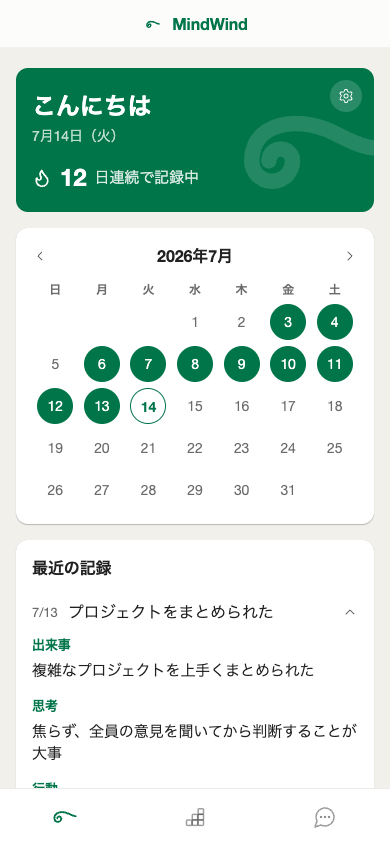
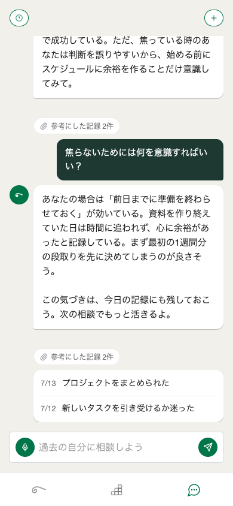
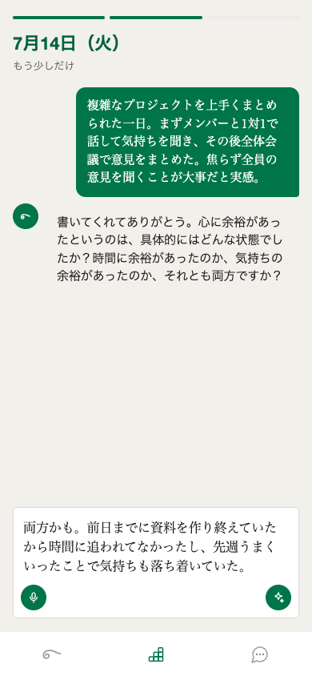
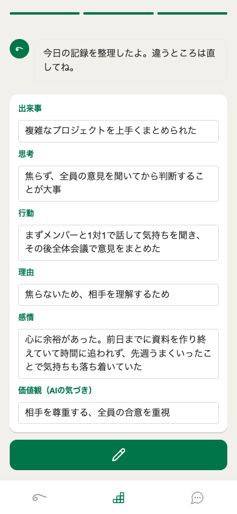

# MindWind - あなたが自分のメンター

調子がいい時、結果が出ている時、そのマインドと行動を記録しておく。調子が悪い時、結果が出ていない時、その記録を見て再現する。つまり、**あなたが自分のメンターになる。**

## ペルソナ

**新卒社会人で、メンターにはずれ、自分が客観視できない人**

- 配属直後、判断基準がない
- 頼れるメンターがいない、または悪いメンターに当たった
- ミスを繰り返しているが、原因が分からない
- 自分の考えが正しいのか不安
- 「日記を書いて整理してみたい」と考えている人

## 問題と解決

### 問題：メンターのアドバイスが的確ではなく、悩みが解決されない

- メンターのアドバイスをもらったけど、自分の状況に合わなかった
- 相談しても「頑張れ」とか抽象的なアドバイスで悩みが解決しない
- 誰にも相談できない立場にいて、判断基準がない
- メンター自身が経験していないことについてアドバイスをもらうから、ピンとこない
- 同じ悩みを何度も繰り返して、判断基準が定まらない

### 解決：すべての感情・経験から、自分のパターンを認識する

1. **すべての感情を記録** - うまくいった時も、つらい時も、失敗した時も
2. **パターンを認識** - 成功パターンと失敗パターンの両方が見える
3. **再現 or 回避** - うまくいったやり方は再現、失敗したやり方は避ける

## 使い方

### 毎日：日記を書く（チャット形式・3分以内）

記録タブはチャット画面。**日記 → 深掘り → 成形** の3ステップで、その日のことが構造化されて積み重なります。

1. **日記** — 今日のことを音声またはテキストで自由に話す/書く（書くヒント付き）
2. **深掘り** — AI が1回だけ質問を返す（曖昧なところを具体化。スキップ可）
3. **成形** — AI が日記＋回答を **出来事 / 思考 / 行動 / 理由 / 感情 / 価値観** の6項目＋タイトルに整理してチャット内にカード表示。その場で編集して保存

保存するとホームに戻り、ストリークとカレンダーが更新されます（記録は1日3件まで）。

### 迷った時：過去の自分に相談する

相談タブは ChatGPT のようなスレッド式チャット。質問すると AI があなたの記録をベクトル検索し、**過去のあなたの記録だけを根拠に** Yes/No の明確なアドバイスを返します。

```
「新しいプロジェクト、リーダーとして引き受けるべき？」

→ 「引き受けるべきだと思う。過去のあなたは、心に余裕がある状態で、
   まずメンバーと1対1で話してから全体をまとめるやり方で成功している。
   ただ、焦っている時のあなたは判断を誤りやすいから、
   始める前にスケジュールに余裕を作ることだけ意識してみて。」
   📎 参考にした記録 2件（タップで中身を確認できる）
```

追い質問で会話を続けられ、過去の相談は履歴から見返せます（スレッド間で文脈は混ざりません）。

### 初回：プロフィール登録（スキップ可）

呼び名・いましていること・ステージ（学生〜社会人3年目以上）・目標を登録すると、深掘りや相談があなたの立場を踏まえた内容になります。

## メリット

- **メンターに依存しない** - 悪いメンターの影響を受けない
- **外れメンターがない** - あなたの経験が100%正解
- **再現性が高い** - あなたのマインドと行動だから、同じ結果が出やすい
- **自信が出る** - 「自分はこの時はうまくいく」という根拠が明確
- **判断が早くなる** - 迷う時間が減る

## 画面

モックは [`mockups/`](mockups/) にあります（基準フレーム 390×844）。

| | | |
|---|---|---|
|  |  |  |
| スタート | ホーム（ダッシュボード） | 相談 |
|  |  |  |
| 記録・日記 | 記録・深掘り | 記録・成形（編集可） |

## セットアップ

```bash
git clone https://github.com/communitybrisbane/mindwind.git
cd mindwind
cp .env.example .env.local
npm install
npm run dev
# localhost:3000 で開く
```

### 環境変数

Firebase（クライアント + Admin SDK）、Claude API、OpenAI API の認証情報を `.env.local` に設定してください。詳細は [`docs/DEVELOPMENT.md`](docs/DEVELOPMENT.md) を参照。

---

## 詳細資料

- **技術設計・実装詳細**（モデル選定・データモデル・フロー） → [`docs/ARCHITECTURE.md`](docs/ARCHITECTURE.md)
- **UI/UX デザイン仕様** → [`docs/DESIGN-mindwind.md`](docs/DESIGN-mindwind.md)
- **開発者向け情報**（セットアップ・エラー処理・スコープ） → [`docs/DEVELOPMENT.md`](docs/DEVELOPMENT.md)
- **AI メンターの人格・プロンプト（本番）** → [`docs/mentor-prompt.md`](docs/mentor-prompt.md)
- **UI モック** → [`mockups/`](mockups/)

---

**毎日の記録が、あなたの最高の相談役になる。**
